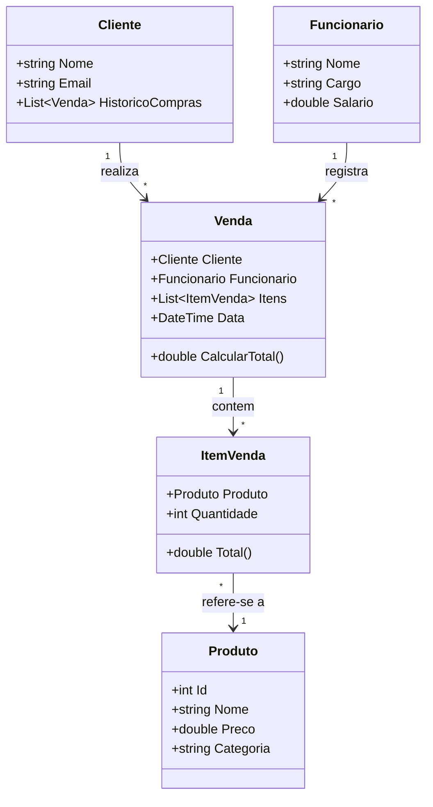

O sistema foi modelado utilizando Programação Orientada a Objetos.  
As entidades principais são Cliente, Produto, Venda, Funcionário e Loja.  
As relações mostram que um cliente pode realizar múltiplas vendas e cada venda contém uma coleção de produtos utilizando List<T>.
Produto representa os itens vendidos pela loja.

Cliente representa quem compra.

Funcionário representa quem registra a venda.

Venda representa a transação.

ItemVenda liga um produto a uma quantidade dentro da venda.

## Diagrama de Classes

## Fluxograma do Projeto
[](https://mermaid.live/edit#pako:eNp1VMuOmzAU_RXL0uySCAIkwKJSQh6t1IyqmaqLAgsXPIlVsCNj1OmEfEzVXaWu-gn5sRo7vKYpK-49595zfH3lE0xYiqEPnzL2LTkgLsDHVUQjCuS3CN_Ry--EMJAy8EgKgXMUg_H4DViGO0xL8IETmpAjyuKmZFnDlVmBoGGwtBSsiPvwtAIrDQcZwVTgIWxVYK3hTSnbM3r5wcmrFnYFNprzCdMUDUGnAtvwAWdIXP78U2lU4G24IXn_TI37u7vWsE4E6rSBGQZIigiOeEOIB4Rp-F626tBiCFvh-jnJSnK7etmTbwaiEyuFr_ryV0I8ILTyr-Z5hTv5W9V9-cHAdXatSOu-hz4rHrBaI7du7srp3Py3T9-Svl8dbhS6MeXlooy8SB2FxgO09TDYjCtoyWPQRK7GrdK-bLc-OrVVjK0ZPuIM165vz2FrqiXbYl7PWe7hNFwXCcsOmIMFZQCD3eVXMSTfX34ysG8rrHCR4KJg4B7vUdo2nmoDtpwe-SKH1xlsGHZzCBVZOoIjuOckhb7gJR7BHPMc1SE81bwIigPOcQR9-Zsi_jWCET3LmiOinxnLmzLOyv0B-k8oK2RUHlMk8IqgPUd5m5X-U8wDVlIBfddUPaB_gs_QH1sT03A9e-7NXMM15rZljeB36JuuMbFmjum6jjebuXPPPo_gi9I1JnNPQrZh2K4zdSzHHUGcEsH4Tj9Y6t06_wW1onZc)
